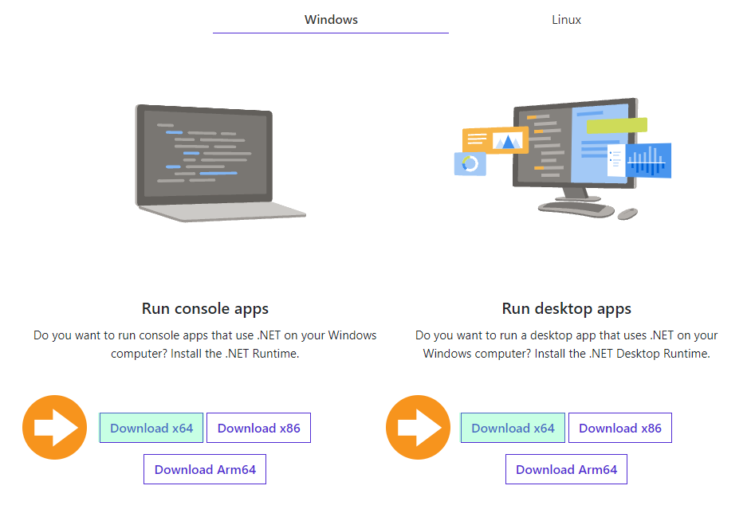

# Somewhere In Between (S.I.B) 
A Skyrim Modding Automation.

https://github.com/bradgillap/somewhereinbetween/releases

# Table of Contents

put some anchor links here.

## Overview

While looking at popular modlists I noticed a few issues:

* Modlists are built for extremely powerful computers or extremely low performance computers. 
* Nearly all the major overhauls run their own Nexus mod pages with custom edits designed for their particular modlists. This creates incompatibilities if you wish to add or change their lists.

This makes customization difficult for the amateur modder and lead me to building my own modlist. I followed a set a of rules for myself to avoid bugs, add content, and improve on the vanilla experience based on Reddit & Nexus community sentiment. This is based on my modding experiences over 10 years of Skyrim and general I.T professional knowledge.

The following are rules I followed while building this:

### Rules/Pros
* All mods must work together using patches available on the  Nexusmods site. No extenuating custom edits. Nothing an amateur couldn't do themselves by reading.
* All texture mods should be aware of middle grade graphics cards and systems. Textures right in front of your face should be 1-2k while everything else should look passable to play.
* I will read at least the first few pages worth of comments on each mod  page to determine compatibility, issues, and community sentiment. 
* I will teleport into cells affected by mods and test interactions where possible.
* I will stress test by setting movement speed high and traversing the world.
* I will be aware of the various types of systems in SkyrimSE and how they interact with each other. 
* I will build for the latest 1.6xxx edition binary only as this is the future.
* I will focus on the experience based on sentiment rather than number of mods, or comparison to the big mod lists.
* I will maintain appropriate documentation. 
* I will mark if it's safe to upgrade or if a new save is required on release pages.

### Cons
* This will be an enhanced vanilla experience but mostly vanilla with self contained well tested additons only. Don't expect gigantic NPC addtions, dungeons.
* This will not be the kitchen sink and may have mods stripped out that are problematic.
* I do not have the time to do entire play through bug testing between versions. Please provide feedback through issues.

## Requirements

### Specifications

Size Installed: **88 Gigabytes**. This is in addition to your vanilla 14GB SkyrimSE install.

My Specs: 
* **CPU**: Intel Core i7 3770 3.4ghz overlcoked to 4.2ghz (Ivy Bridge 22nm).
* **RAM**: Memory 800mhz DDR3 32GB. (16gb is probably fine).
* **Video**: Geforce 1060 6GB Edition (16nm). This is similar to a Geforce 1660.

### Accounts

1. A [NexusMods](https://www.nexusmods.com/modrewards#/store/item/35) premium account.
2. An account on https://vectorplexus.com/. (Note: Do not use oauth style sign-ins. A regular account works best).

## Installation 

This is basic installation to just get up and running. For additional features like hair physics, please see the wiki pages on this github. I provide step by step screenshots and gifs that will getyou up and running in a few minutes.

### Install SkyrimSE. (Step 1)

Make sure you open SkyrimSE at least once to allow for configuration files to update with your default video settings. 

### Dot Net 6.0 Requirements. (Step 2)

Some mods require Dot Net frameworks. [Download Here](https://dotnet.microsoft.com/en-us/download/dotnet/6.0/runtime)

### Wabbajack Mod installer (Step 3)

Wabbajack is the program that will install all of the mods based on my list and complete the automation. 

[Download WabbaJack](https://www.wabbajack.org/#/) and save it to an empty folder on your computer. 

### Latest S.I.B Release (Step 4)

1. Download the latest release from: https://github.com/bradgillap/somewhereinbetween/releases
2. Extract with 7zip to your WabbaJack folder or a subfolder within your wabbajack folder.  Example C:\Wabbajack\SIB\releasefiles.example

### Open Wabbajack and prepare to install the S.I.B List.

Template stuff.
------

Important Mods you should know about: This is an important section you should not forget. Go in-depth on core mods and talk about important mods the user should know about. It can be overwhelming for the user to just be thrusted into a completely modded world without knowing what's even included and possible.

MCM: If your Modlist has some sort of MCM like for Skyrim or Fallout 4 then you should give instructions on what settings to use

Changelog: Should not be in the README and can be in a separate file called CHANGELOG.md but make sure to create one
