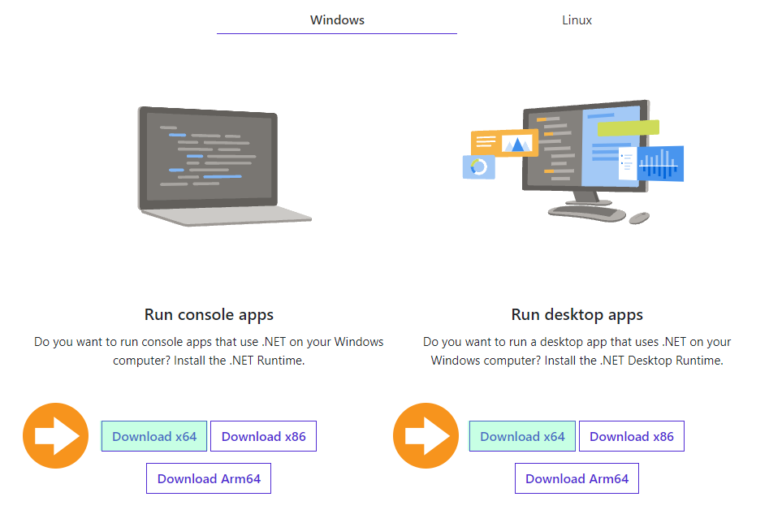
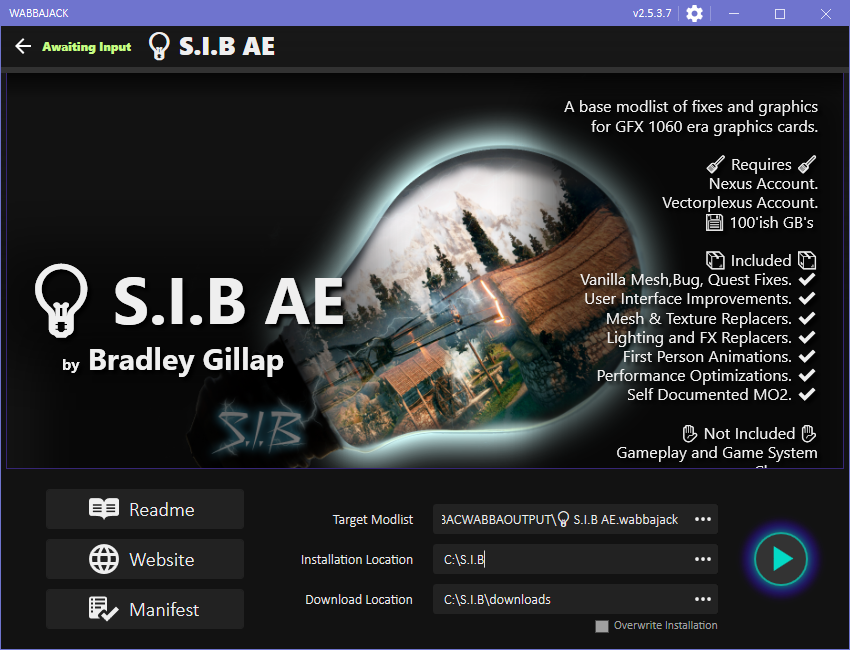

# Somewhere In Between (S.I.B) AE
A Skyrim AE Mod Automation for [Wabbajack](https://www.wabbajack.org/#/). Designed to work as a starting point for modding AE on midrange hardware.

>🧠 Experience level recommended with Skyrim Mods Intermediate to Advanced with learning oppourtunities for beginners.

## Latest Release

* S.I.B is without world edits, new items, quests. This is designed for the user to build upon.
* Authors cut has my hand selected gameplay, quest, and recommendations already installed.

| Variant                                                                                          | S.I.B Version | Skyrim AE Version | Release Date | Download Mod list |
|:------------------------------------------------------------------------------------------------:|:-------------:|:----------------:|:------------:|:----------------:|
| Somewhere In Between                                                                             | v1.0.0        | 1.6.353.0        | [Download](https://github.com/bradgillap/somewhereinbetween/releases/download/v1.0.0/S.I.B.AE.v1.0.0.7z)           |                  |
| Authors Cut [(More Info)](https://github.com/bradgillap/somewhereinbetween/wiki/SIB-Authors-Cut) | v0.1.0        | 1.6.353.0        | Soon         |                  |

 | Variant              | S.I.B Version | Skyrim AE Version | Release |  
 |----------------------|---------------|-------------------|---------|
 | Somewhere In Between | v1.0.0        | 1.6.353.0         | [Download](https://github.com/bradgillap/somewhereinbetween/releases/tag/v1.0.0)        |
 | [Authors Cut](https://github.com/bradgillap/somewhereinbetween/wiki/SIB-Authors-Cut)          | v0.1.0        | 1.6.353.0         | Soon |


# Table of contents

- [Somewhere In Between (S.I.B) AE](#somewhere-in-between-sib-ae)
  - [Latest Release](#latest-release)
- [Table of Contents](#table-of-contents)
  - [Overview](#overview)
    - [Included](#included)
    - [Purposefully Not Included](#purposefully-not-included)
  - [System Specifications](#system-specifications)
  - [Requirements](#requirements)
    - [Website User Accounts](#website-user-accounts)
  - [Installation Instructions](#installation-instructions)
    - [Install Skyrim AE Via Steam. (Step 1)](#install-skyrim-ae-via-steam-step-1)
    - [MS Framework Requirements. (Step 2)](#ms-framework-requirements-step-2)
    - [Wabbajack Mod installer (Step 3)](#wabbajack-mod-installer-step-3)
    - [Latest S.I.B Release (Step 4)](#latest-sib-release-step-4)
    - [Open Wabbajack and prepare to install the S.I.B List. (Step 5)](#open-wabbajack-and-prepare-to-install-the-sib-list-step-5)
  - [Post installation Instructions](#post-installation-instructions)
## Overview

While looking at popular mod lists I noticed a few issues:

* Mod lists are built for extremely powerful computers or extremely low performance computers.
* Nearly all the major overhauls run their own Nexus mod pages with custom edits designed for their particular mod lists. This creates incompatibilities if you wish to add or change their lists.

The intention of S.I.B is to provide a Wabbajack list to build upon. Stripped down of mods that often conflict focusing mostly on bug fixes, meshes and textures.

### Included

* Mesh,Bug,Quest Fixes.
* User Interface Improvements.
* Mesh & Texture Replacers.
* Lighting and FX Replacers.
* New Animations.
* Performance Optimizations.
* Self Documented Mod Organizer.

### Purposefully Not Included

* Gameplay and Game System Changes.
* New Quests.
* New Items, Weapons, or Armour.
* Interrior or Exterior World Edits.


## System Specifications

S.I.B AE Install Size: **101'ish Gigabytes**.

My Specs:
* **CPU**: Intel Core i7 3770 3.4ghz overclocked to 4.2ghz (Ivy Bridge 22nm).
* **RAM**: Memory DDR3 32GB. (12GB-16gb is probably fine).
* **Video**: GeForce 1060 6GB Edition (Tested). This is similar to a GeForce 1660. A GeForce 770 was tested with ENB Performance Option (See Wiki for Recommendations).

## Requirements

Software: Skyrim Anniversary Edition from Steam.

### Website User Accounts

1. [NexusMods](https://www.nexusmods.com/modrewards#/store/item/35)  **Free or Premium**.
2. [Vectorplus](https://vectorplexus.com/) **Free Account**.

(Note: **Do not use OAuth style sign-ins.** A regular account works best with Wabbajack).

## Installation Instructions

Follow along for installation instructions.

Post Installation instructions available on the [wiki](https://github.com/bradgillap/somewhereinbetween/wiki).

### Install Skyrim AE Via Steam. (Step 1)

Make sure you open SkyrimSE at least once to allow for configuration files to update with your default video settings. Allow creation club content to download. Then close the game.

### MS Framework Requirements. (Step 2)

1. Dot Net frameworks. [Download Here](https://dotnet.microsoft.com/en-us/download/dotnet/6.0/runtime).

**Get both CLI and Desktop Versions of DOTNET 6.**
[](https://dotnet.microsoft.com/en-us/download/dotnet/6.0/runtime).

3. Visual C++.         [Download x64 Version](https://docs.microsoft.com/en-US/cpp/windows/latest-supported-vc-redist?view=msvc-170).
4. DOTNET SDK          [Download x64 Version](https://dotnet.microsoft.com/en-us/download).
5. DOTNET 3.5 (Available Ondemand for Windows 10 Users) [Instructions](https://docs.microsoft.com/en-us/dotnet/framework/install/dotnet-35-windows).

### Wabbajack Mod installer (Step 3)

Wabbajack is the program that will retrieve and install all of then complete the automated installation.

[Download WabbaJack](https://www.wabbajack.org/#/) and save it to an empty folder on your computer.

### Latest S.I.B Release (Step 4)

1. Download the latest S.I.B release from: https://github.com/bradgillap/somewhereinbetween/releases
2. Extract with 7zip to your WabbaJack folder.

Example:

```
C:\Wabbajack\SIB\releases\S.I.B AE.wabbajack
```

### Open Wabbajack and prepare to install the S.I.B List. (Step 5)

[]

Wabbajack png with marked paths and descriptions by number for the user.

1. **Target Modlist** : Point this to the release file you downloaded for S.I.B.
2. **Installation Location** : Set this to the folder you want to install S.I.B to. Example: ``C:\S.I.B``
3. **Download Location** : Your Downloads folder for files downloaded from sites like Nexusmods. Example : ``C:\S.I.B\Downloads``

## Post installation Instructions

While S.I.B will work out of the box. We recommend the post installation instructions because it adds further stability and visualization improvements.

[S.I.B Wiki Post Installation Instructions](https://github.com/bradgillap/somewhereinbetween/wiki).
